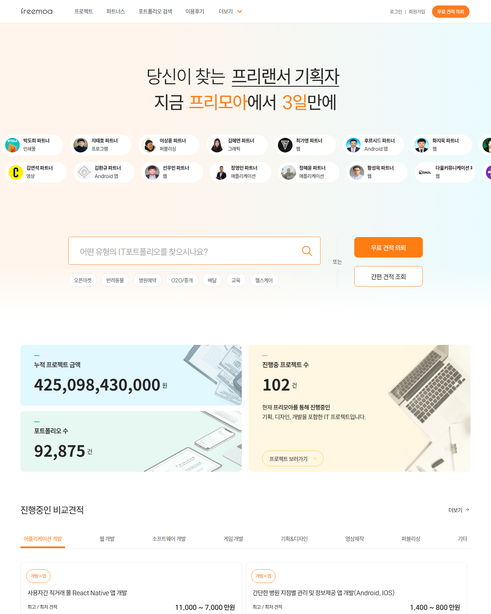
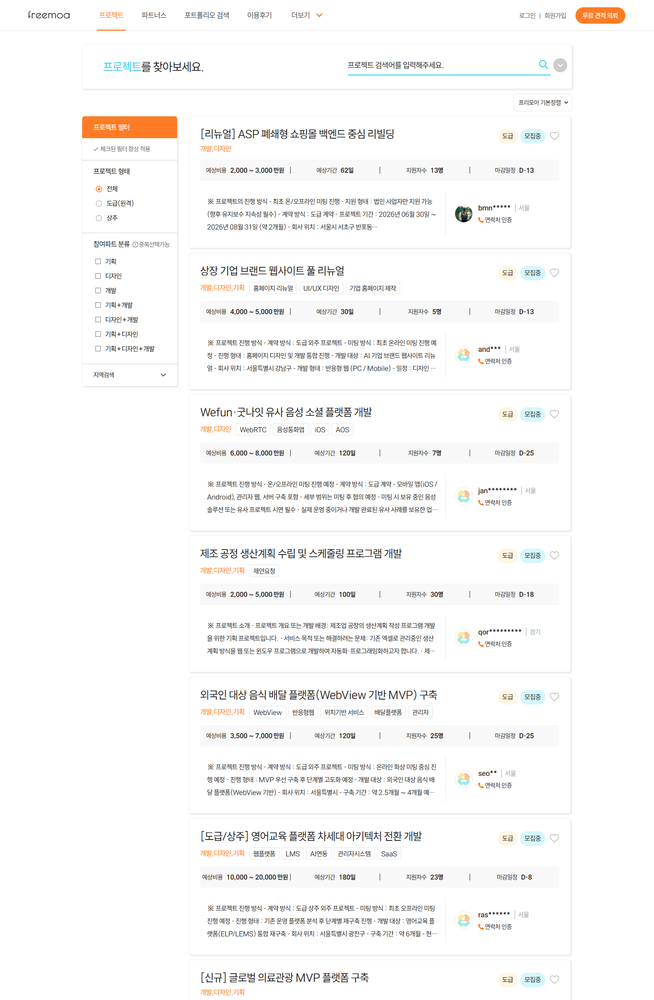
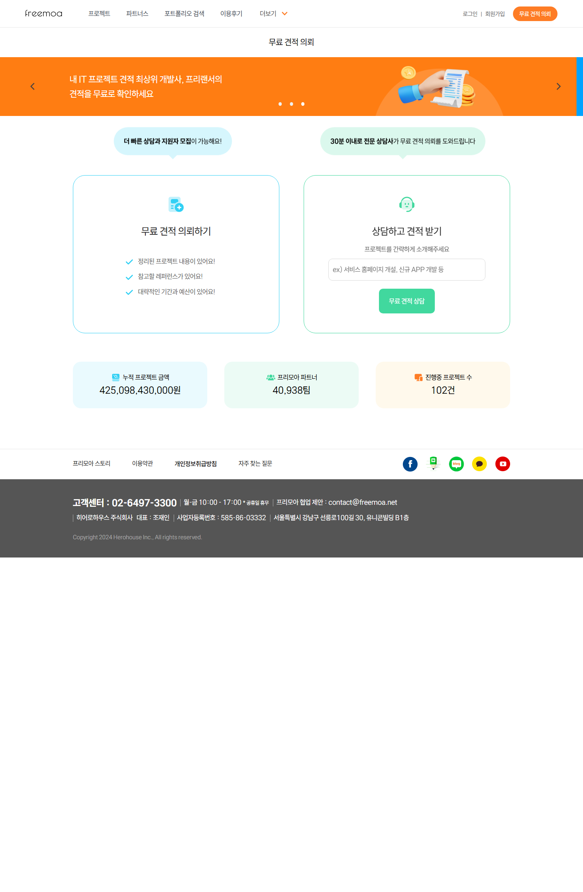
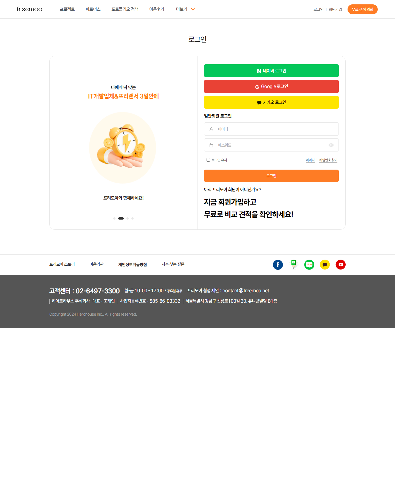
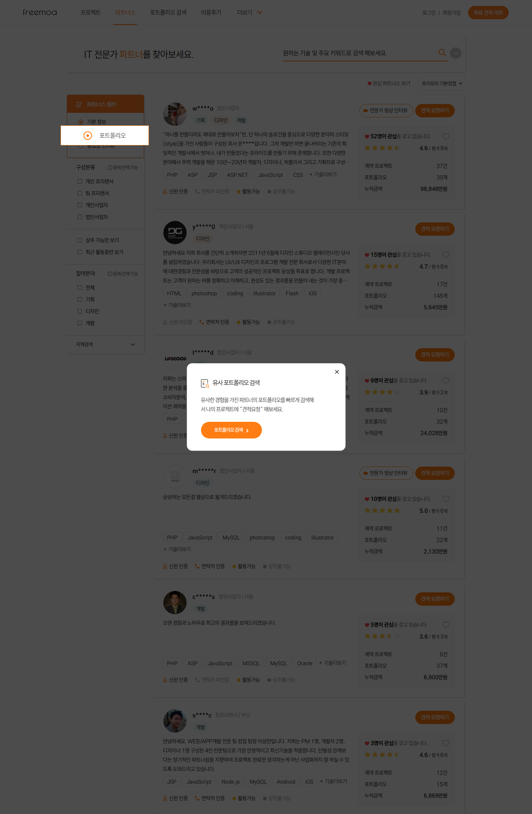
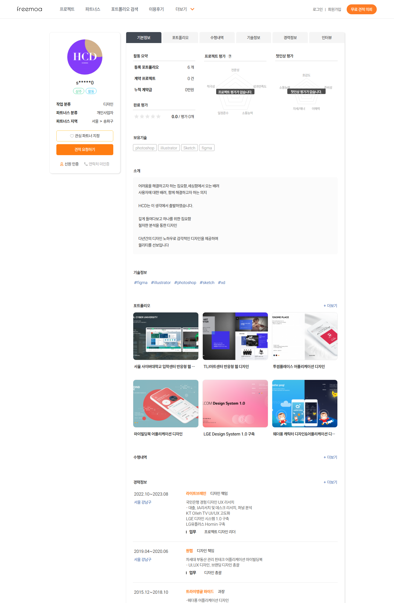

# 프리모아 UI 참고 자료

프론트엔드 구현 전에 프리모아 공식 사이트에서 공개 접근 가능한 화면을 캡처하고, 텀프로젝트 요구사항에 맞춰 어떤 화면 구조를 가져올지 정리한 문서입니다.

참고 사이트: https://www.freemoa.net/

## 캡처 목록

| 용도 | 원본 URL | 저장 이미지 |
| --- | --- | --- |
| 홈/공통 헤더/CTA/톤 | `https://www.freemoa.net/` |  |
| 프로젝트 찾기/필터/카드 | `https://www.freemoa.net/m4/s41` |  |
| 프로젝트 의뢰 진입 | `https://www.freemoa.net/m4/regProject` |  |
| 로그인/세션 인증 화면 | `https://www.freemoa.net/m0/s02` |  |
| 파트너 목록/카드 스타일 | `https://www.freemoa.net/m7/s71` |  |
| 파트너 상세/프로필 스타일 | `https://www.freemoa.net/m7/freelance_detail?fno=29832` |  |

프로젝트 상세, 지원하기, 마이페이지 내부 화면은 인증 컨텍스트가 필요했습니다. `/m4a/s41v` 상세 Ajax는 비로그인 상태에서 `로그인이 필요한 서비스입니다.`를 반환했습니다. 따라서 해당 화면들은 공개 캡처가 아니라 요구사항 명세와 공개 목록/프로필 화면 스타일을 조합해 구현합니다.

## 공통 스타일

- 상단 헤더는 흰 배경, 좌측 `freemoa` 로고, 가운데 메뉴, 우측 로그인/회원가입/주황색 CTA 구조입니다.
- 주 색상은 주황색 CTA와 하늘색 보조 강조입니다. 버튼은 주황색 채움형을 primary로, 흰 배경+주황 테두리를 secondary로 사용합니다.
- 본문 배경은 연한 회색 계열, 주요 콘텐츠는 흰 카드와 얇은 회색 border/shadow로 분리합니다.
- 폰트는 Noto Sans KR 계열 느낌이며, 제목은 22~28px, 카드 본문은 14~16px 정도의 밀도 높은 정보형 레이아웃입니다.
- 카드 radius는 작게 유지합니다. 프리모아는 둥근 버튼을 쓰지만, 과제 UI에서는 과한 pill 남발보다 정보 카드 중심이 좋습니다.

## 구현 화면별 기준

### 1. 렌딩/프로젝트 찾기

기준 이미지: `02-project-list.png`

- 개발자와 의뢰인 공통 첫 화면은 프로젝트 찾기 화면입니다.
- 좌측 필터는 요구사항에 맞춰 `프로젝트 형태`만 필수 구현합니다: 전체, 도급(원격), 상주.
- 우측 상단 정렬 드롭다운은 `프리모아 기본정렬`, `최신 등록 순`, `금액 높은 순`, `금액 낮은 순`, `마감 임박 순`을 제공합니다.
- 프로젝트 카드는 제목, 분야/기술 태그, 예상비용 또는 월 임금, 예상기간, 지원자 수, 마감 D-day, 도급/상주 뱃지, 모집중/마감 뱃지를 표시합니다.
- 과제 조건상 프로젝트 목록 페이지 사이즈는 실제 프리모아와 달리 `4`로 고정하고, 필터/정렬/페이지 변경마다 서버 API를 다시 호출해야 합니다.

### 2. 프로젝트 상세/지원하기

공개 상세 캡처는 인증 필요로 확보하지 못했습니다. 구현은 `02-project-list.png`의 카드 스타일을 상세화합니다.

- 상세 화면은 요약 탭만 구현합니다.
- 상단에 고용형태 뱃지, 모집 상태 뱃지, 등록일, 프로젝트명, 비용, 예상 기간, 지원자 수, 마감일정, 관련 기술을 표시합니다.
- 지원하기 화면은 상세 요약 영역 아래에 폼을 배치합니다.
- 도급은 작업기간, 지원 금액, 지원 내용만 받습니다. 인원수는 1명으로 고정합니다.
- 상주는 기술구분, 연차구분, 인원수, 임금, 지원 내용을 받습니다.
- 지원 내용 textarea에는 이메일/전화번호 정규식 차단 로직을 반드시 연결합니다.

### 3. 의뢰인 프로젝트 의뢰

기준 이미지: `04-project-register.png`

- 프리모아 공개 화면은 “무료 견적 의뢰” 진입 카드 구조입니다. 과제에서는 이 분위기를 유지하되 바로 등록 폼으로 구성합니다.
- 필수 필드: 프로젝트명, 모집마감일, 고용형태, 예산, 프로젝트 분야, 기획상태, 미팅 희망 지역, 업무내용, 프로젝트 진행 방식, 필요 기술 스택.
- 폼은 한 화면에서 스캔하기 쉽게 2열 섹션 또는 단계형 카드로 구성합니다. 제출 버튼은 주황색 primary CTA로 둡니다.

### 4. 개발자 마이페이지/프로필 수정

기준 이미지: `07-partner-detail.png`

- 좌측에는 프로필 이미지, 이름/유형/지역/상태 정보를 카드로 고정하고, 우측에는 탭과 폼 영역을 둡니다.
- 개발자 마이페이지 탭은 요구사항대로 `프로젝트 관리`, `프로필 관리`만 노출합니다.
- 프로필 수정 필드는 지원분야 체크박스, 활동가능/상주가능 체크박스, 지역 2단 셀렉트, 형태+연차, 검색태그, 소개글, 프로필 이미지 업로드로 구성합니다.
- 검색태그는 chip 형태로 보여주고 `x` 삭제 버튼을 둡니다. 5개 초과 입력 시 alert/toast를 띄웁니다.
- 프로필 이미지는 클라이언트 public/assets에 저장하지 않고 multipart/form-data로 서버에 전송합니다.

### 5. 개발자 지원 프로젝트 관리

- 프로젝트 목록 카드를 더 압축한 리스트 형태로 구성합니다.
- 표시 항목: 프로젝트 제목, 견적, 지원자 수, 과업일수, 상세보기 버튼.
- 상세보기 안에는 요구사항대로 `나의 지원서` 버튼을 두고, 클릭 시 이전 지원 내용을 모달 또는 우측 패널로 보여줍니다.

### 6. 의뢰인 프로젝트 관리

- 등록 프로젝트 리스트는 `02-project-list.png`의 카드 밀도를 참고합니다.
- 표시 항목: 프로젝트명, 예상 금액, 계약 형태, 지원자 수, 모집 마감일, D-day, 상세보기 버튼.
- 상세 화면은 의뢰 내용 요약과 지원자 테이블을 나눕니다.
- 지원자 테이블은 순번, 예상 금액, 지원일/고용형태, 상세보기 버튼을 표시합니다.
- 더보기 페이지 사이즈는 `2`입니다. 더 이상 데이터가 없으면 더보기 버튼을 숨기거나 disabled 처리합니다.

## 공식 API 탐색 메모

- 프로젝트 목록은 공개 Ajax `POST /m4a/s41a`로 내려옵니다.
- 목록 응답에는 `proj_idx`, `title`, `cost_min`, `cost_max`, `during`, `edate`, `INS_TIME`, `is_stay`, `proj_language`, `ALL_APPLY_COUNT`, `proj_filed_new` 등이 포함됩니다.
- 상세 Ajax `POST /m4a/s41v`는 비로그인 상태에서 로그인 필요 응답을 반환했습니다.
- 우리 구현에서는 프론트 정렬을 하지 않고, 위 목록 응답 구조를 참고해 서버에서 필터/정렬/페이지네이션된 데이터를 내려주도록 맞춥니다.

## 우선 구현 화면

1. 프로젝트 찾기: 필터, 정렬, 프로젝트 카드, 페이지네이션.
2. 프로젝트 상세/지원하기: 도급/상주 분기 폼, 연락처 차단.
3. 개발자 마이페이지: 프로필 수정, 이미지 업로드, 지원 프로젝트/지원서 조회.
4. 의뢰인 마이페이지: 프로젝트 의뢰 폼, 등록 프로젝트 관리, 지원자 더보기/지원서 열람.
